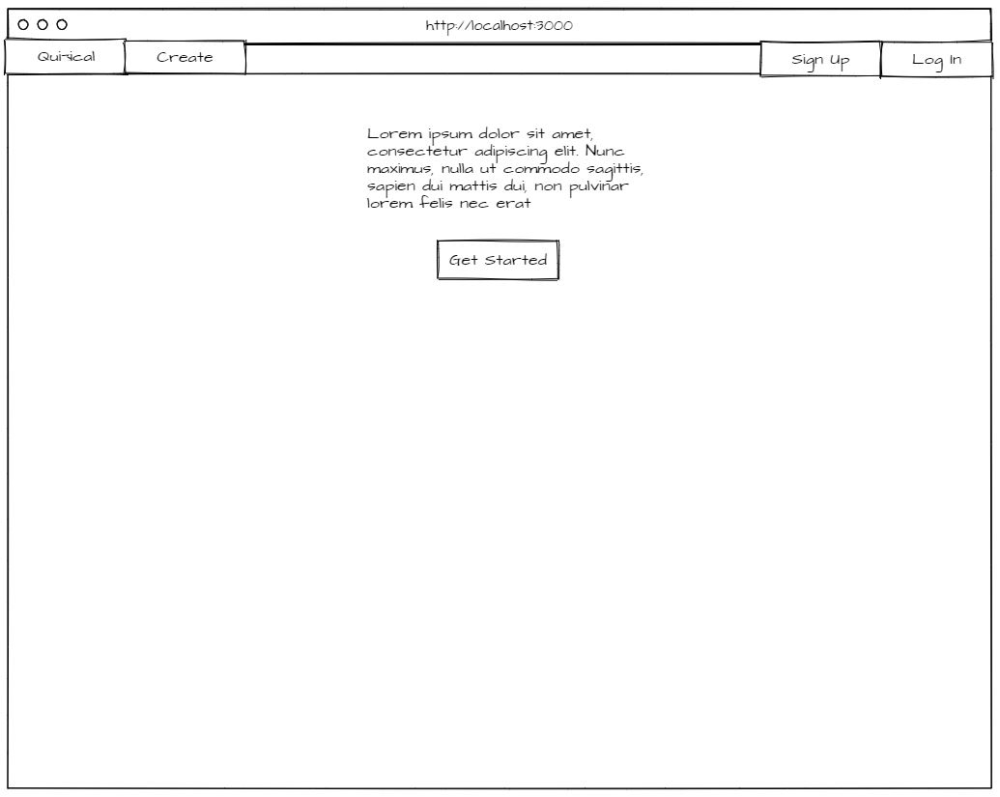
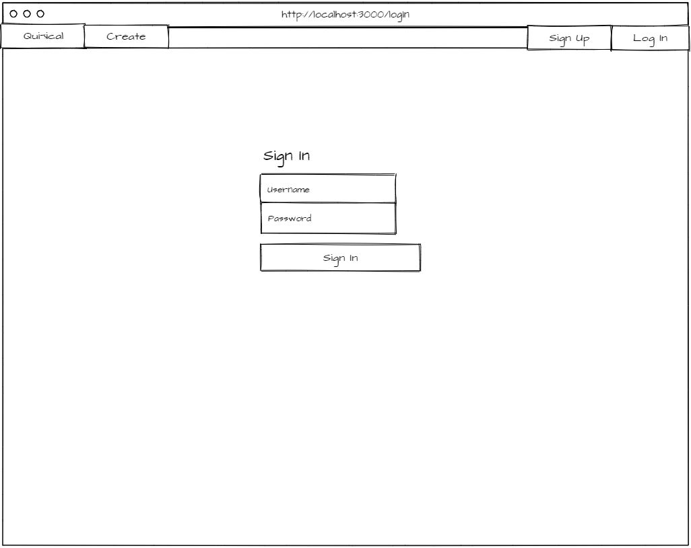
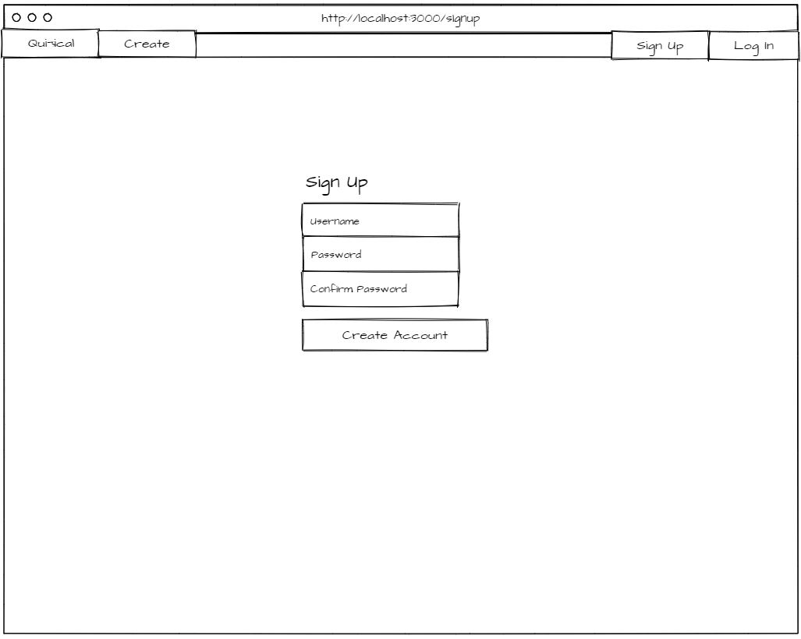
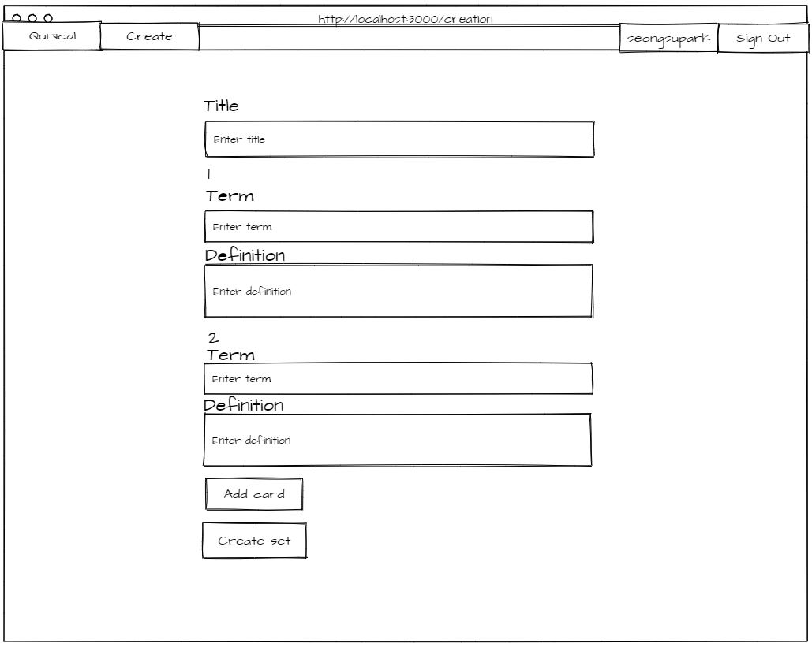
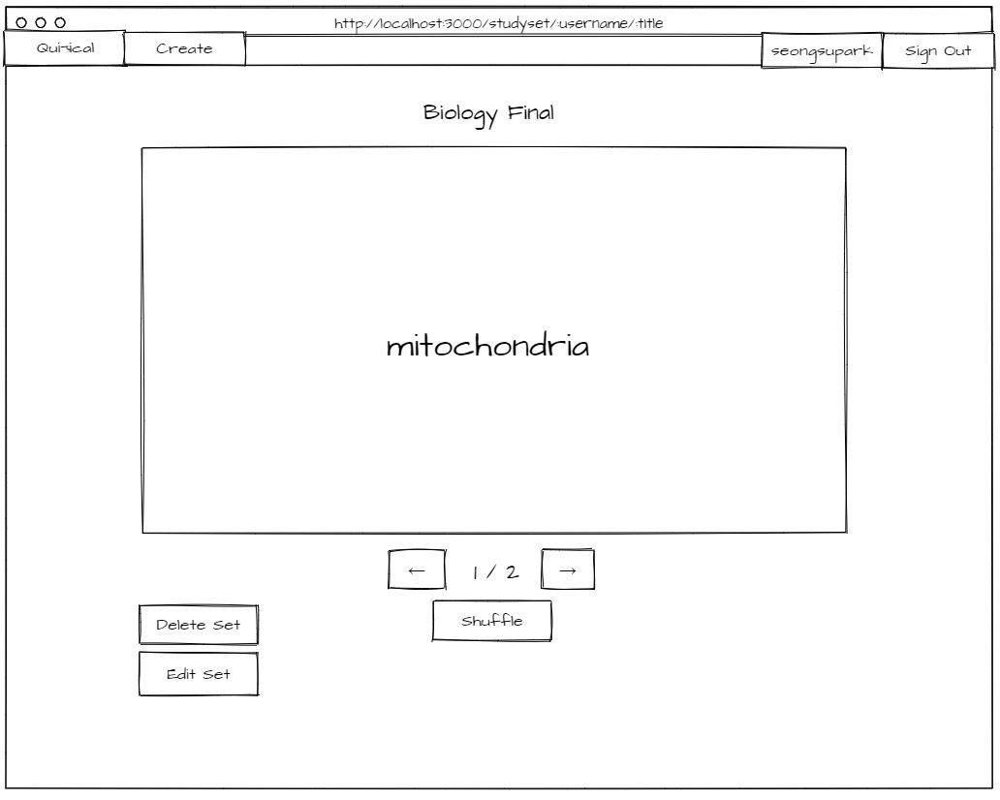
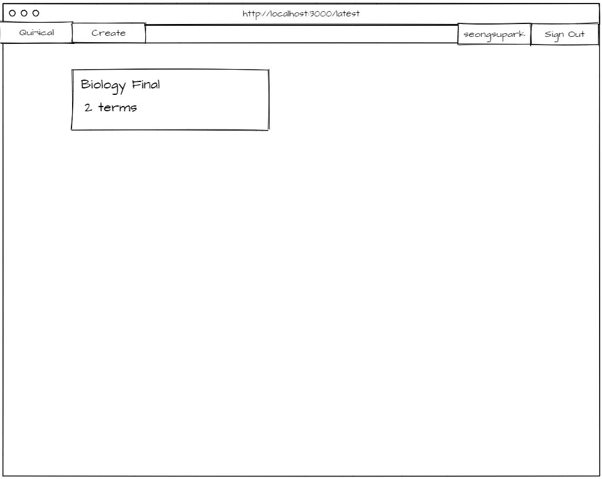
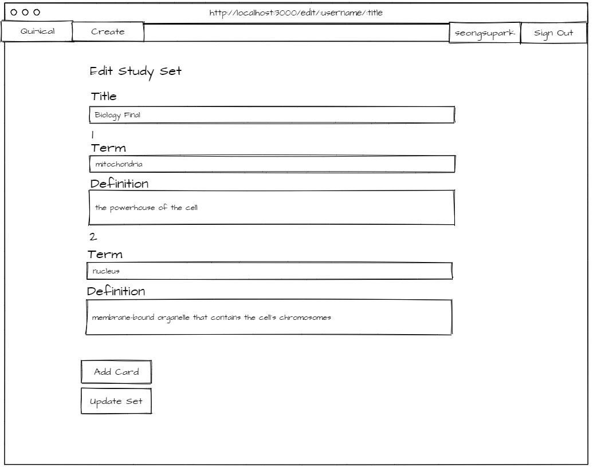

# Quizical
* [App Link](https://quizical-project.herokuapp.com/)

## App Summary
Quizical is an application for students who need digital flashcards to study off of.

## Wireframe

### Home Page

### Login Page

### Signup Page

### Creation Page

### Studyset Page

### Latest Page

### Edit Page

## User Stories
* AAU, I can login and logout of my account
* AAU, I can create a study set of flashcards
* AAU, I can title my study set
* AAU, I can give each flash card a term and definition
* AAU, I can add more flash cards while creating my study set
* AAU, I can view all my study sets in my account page
* AAU, I can delete my study sets
* AAU, I can edit my study sets

## Technologies Used

* Node Modules
  * body-parser
  * dotenv
  * ejs
  * express
  * express-session
  * mongoose
  * passport
  * passport-local-mongoose
  * request
* MongoDB Atlas
* jQuery
* Bootstrap
* Heroku
* GitHub

## Approach

* Started by creating user stories and breaking down the problem into smaller parts
* There is no Google authentication because I wanted to try it without it (this is unsafe)
* MongoDB, EJS, Node, and Express were all new to me when developing this project, so I've made some bad practices.
  * Not implementing a Model View Controller framework to make the code more readable.

## Improvements

Separating the app.js code will greatly improve readability.
I've realized this after I've coded this project and saw similar model-view-controller projects using the same stack.
In my future projects that utilize routing, I will definitely separate them.
