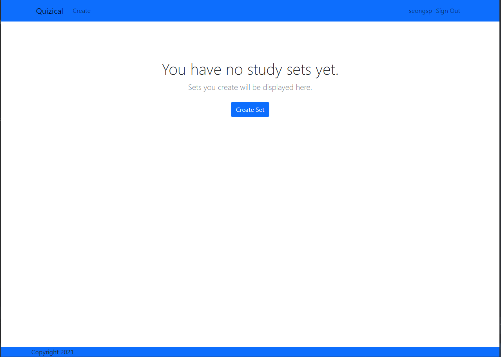

# Quizical
* [App Link](https://quizical-project.herokuapp.com/)

## App Summary
Quizical is an application for students who need digital flashcards to study off of.

## User Stories
* AAU, I can login and logout of my account
* AAU, I can create a study set of flashcards
* AAU, I can title my study set
* AAU, I can give each flash card a term and definition
* AAU, I can add more flash cards while creating my study set
* AAU, I can view all my study sets in my account page
* AAU, I can delete my study sets
* AAU, I can edit my study sets

## Screenshots

## Technologies Used

* MongoDB / Mongoose
* Express
* Bootstrap
* Node
* EJS
* Passport
* Amazon AWS
* Heroku

## Improvements

Separating the app.js code will greatly improve readability.
I've realized this after I've coded this project and saw similar model-view-controller projects using the same stack.
In my future projects that utilize routing, I will definitely separate them.
